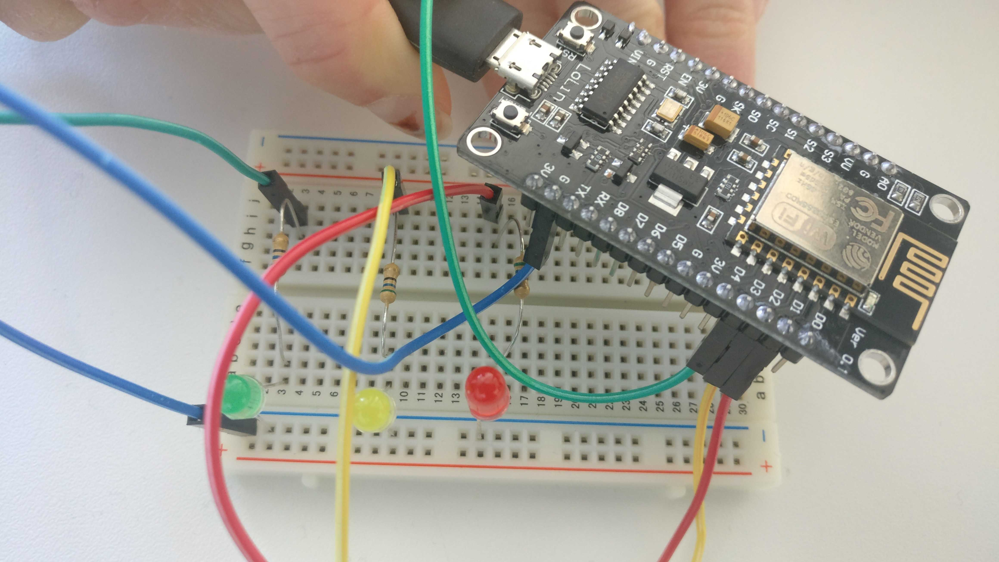

= Anonyme Schüler-Feedback-App

Ein Projekt vom https://www.hacktothefuture.de/[Hack to the Future in Stuttgart 2019]
aus dem Themenraum "Schule der Zukunft"

== Problem

* Wenig Rückmeldung an den Lehrer
* Mitunter unsichere Lehrer ("ist das so gut?", "soll ich das nochmal erklären")
* Problem offenes Feedback durch Schüler
** Persönlicher Groll des Lehrers bei Kritik
** Gruppenzwang ("Streber", etc.)
* Wenig Mitbestimmung über Unterrichtsgestaltung

== Idee

* Anonyme Vorschlags- und Feedback-App
* Daten auch live während des Unterrichts an Lehrer
* Stimmungsampel am Lehrertisch (rot/gelb/grün)
* Verschiedene Feedback-Formen
** Live-"Barometer": Aktuelle Qualität des Unterrichts, Tempo
*** Vorgegebene Auswahlmöglichkeiten
*** Jeder kann seine Meinung jederzeit ändern
*** Wenn mindestens die Hälfte der Schüler eine Stimme abgegeben haben: Abbildung auf Stimmungsampel
*** Jede Stimme ist für fünf Minuten gültig. Wenn bis dahin nicht neu gevotet wurde, verschwindet die Stimme aus der Statistik.
    Man muss also seine Meinung regelmäßig kundtun bzw bekräftigen.
** Feedback/Kritik in Textform
*** Freitext, der Lehrer und Klasse anonym angezeigt wird
*** Um unpopuläre Einzelmeinungen zu vermeiden: Rest der Klasse kann Text mit "Daumen hoch"/"Daumen runter" bewerten.
    So sieht der Lehrer, wieviele Mitschüler hinter der Äußerung stehen bzw. anderer Meinung sind.
* Mobbing-Vorbeugung: Der Vertrauenslehrer kann sich die Klarnamen einzelner Abstimmungen anzeigen lassen

== Unser konkretes Projekt

* Webanwendung, zunächst mit Grundfunktion
** Anmeldung
** Für Schüler: Live-Feedback (zunächst mal: Qualität des Unterrichts)
** Für Lehrer: Aktuelle Bewertung
* Stimmungsampel: Ampelanzeige, über WLAN

== Techniken / Bedarf

* Webandwenung in Java
* Stimmungsampel mit ESP8266 und LEDs

== Meilensteine / Aufgaben

* Einzelne Seiten in HTML erstellen
* Seiten mit Bootstrap "anhübschen"
* Webanwendung: Anmeldung und Abmeldung
* Webanwendung: Feedback abgeben
* Webanwendung: Lehrer-Ansicht
* Ampel bauen und programmieren
* Webanwendung: Ampel ansteuern

== Starten des Projekts

Im Wurzelverzeichnis des Projekts:

----
sbt run
----

Passwörter und URL der Ampel sind momentan fest im Sourcecode eingebaut

== Aufbau Ampel

